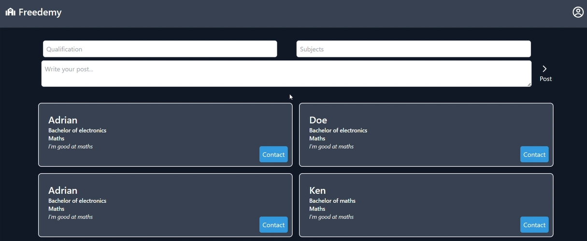
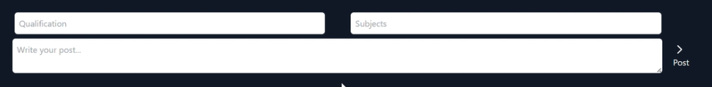
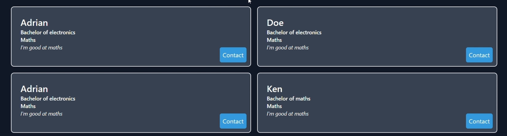
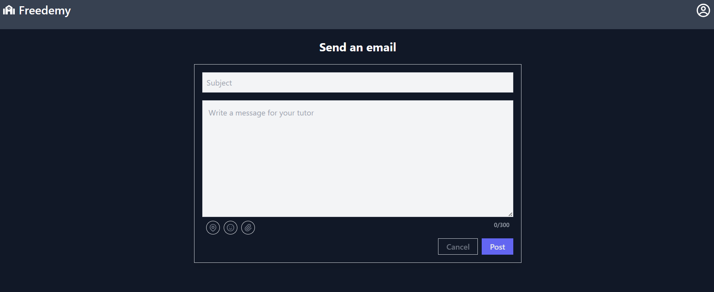
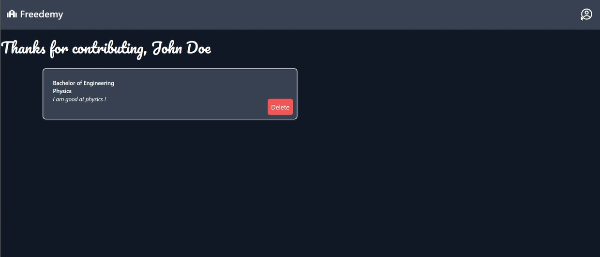

# Tutor Student Project 
This is web app project to help students and tutors connect together. Users are able to find tutor session information that other users offered. The project is built based on MERN stack.

## Table of contents 
- [Installation and usage](#installation-and-usage)
- [Features](#features)

## Installation and usage
As this is a node project and the databse is using mongoDB, mongoDB and node should be installed in your local computer.
1. Clone this project into your computer. Change the config.js file in the backend directory to change the configuration of mongoDB settings.
2. Run `npm install` in both the backend and frontend directory.
3. Run `npm run dev` in both backend and frontend to start the project.

# Features
This project lets you register your own account and connect with tutors through My page. You will have your own dashboard to see courses that you offered to tutor.

## My page
The above image shows the page for users to post and offer tutor sessions and also see courses offered by other tutors.

- Use the interface below to submit posts.

- Courses offered by others is shown on myPage as follows.
- Click the contact button to contact tutors via email.

## Contact page
An email interface for you to contact with your tutor.

## My Dashboard page
Shows the tutor courses that you offered. You are able to delete them also if you no longer want to host a tutor session so that other users won't be able to see the post anymore.[

